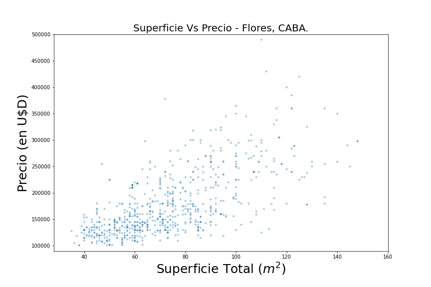
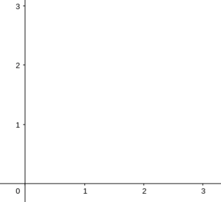
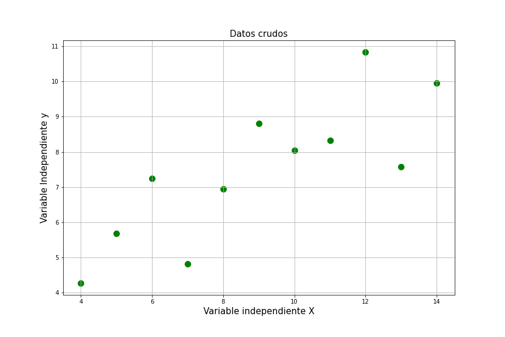
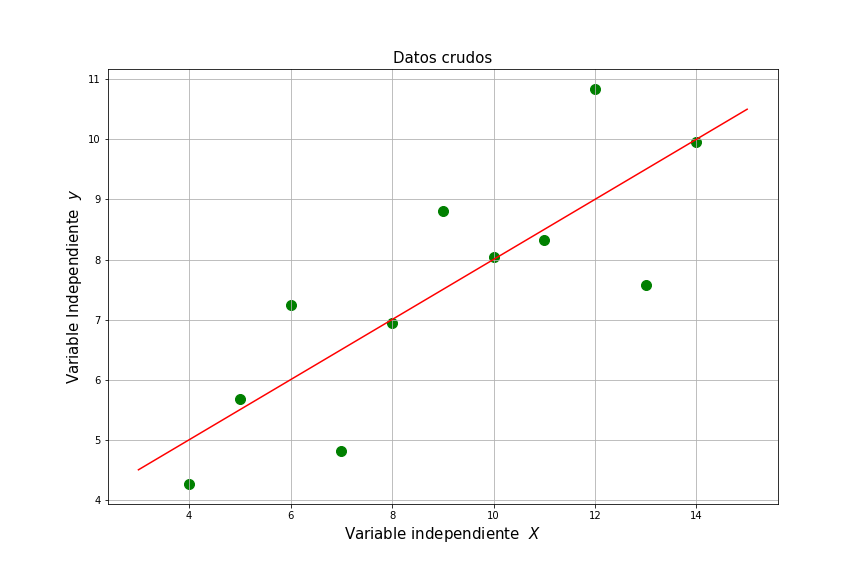
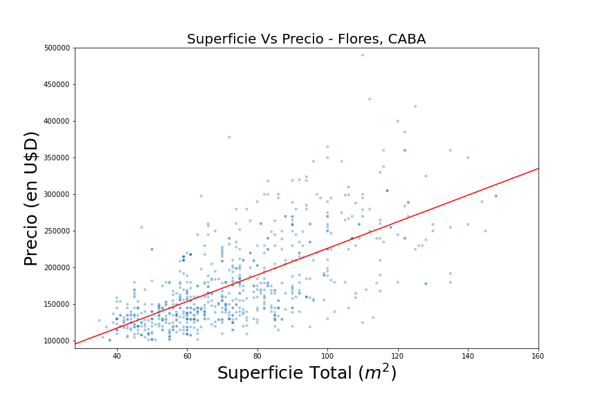

# Regresión Lineal Simple
  

## Palazzo Tomas Alejandro 
### Analisis Avanzado - FCEN - UBA

---

# Precios de propiedades

  
 
 
---

# Objetivo

Nuestro objetivo es poder encontrar una funcion lineal $\hat{y}$ que aproxime lo mejor posible a nuestros datos dados por $y$

Como $\hat{y}$ es lineal, entonces la vamos a escribir de la siguiente forma:
  

$$\hat{y} = \beta + \alpha x$$

---

##  $\hat{y} = \beta + \alpha x$

  

| $\alpha = 0, \beta=2$ | $\alpha = 1, \beta=0$ | $\alpha = -1, \beta=3$ |
| :---:        |     :---:      |          :---: |
|   |      |     |

---
# Función de Costo

  
 

---

# Función de Costo

Lo que tratamos de buscar es que nuestro modelo tenga *el menor error posible*.
Pero, ¿como calculamos ese error? Una forma es la siguiente:

  

$$\min_{\alpha, \beta}L(y, \hat{y}) = \min_{\alpha, \beta} \frac{1}{2n}\sum_{i=1}^n (y_i - \hat{y_i})^2$$

---
##  $\hat{y} = \beta + \alpha x$

        |  $min_{\alpha, \beta}  \frac{1}{2n}\sum_{i=1}^n (y_i - \hat{y_i})^2$ 
:-------------------------:|:-------------------------:

---

  

---

  